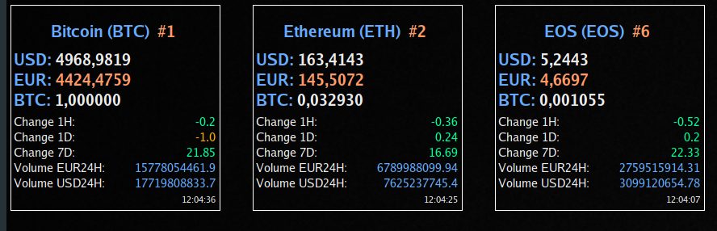

Conky Crypto
=============

Material Design conky with horizontal layout to monitor your favourite crypto currencies using CoinMarketcap API.



## Currency conversion

Update the crypto.conf file with whatever coins you want to monitor. Use the https://coinmarketcap.com/coins/ name for each.

## Installation

The install script will create (if not already existing) ~$HOME/.conky/crypto and it will add one .rc per currency. Will also add the conky start script to Gnome auto-start.

```
./install
```

Inspired by [this](http://www.omgubuntu.co.uk/2013/05/google-now-themed-conky-for-ubuntu-desktop).
